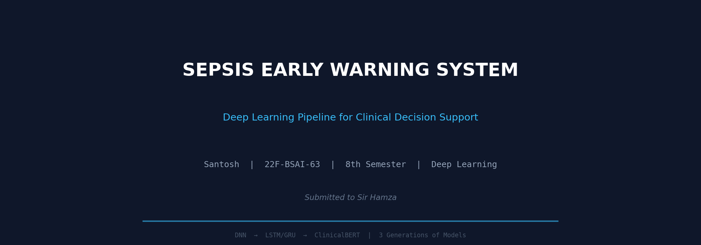
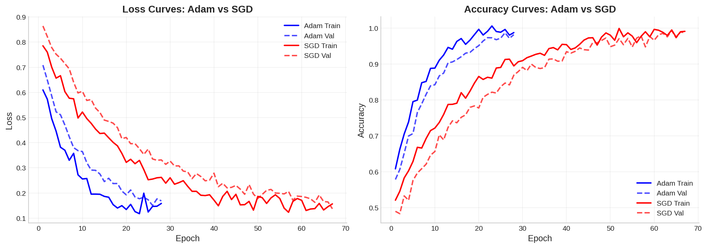
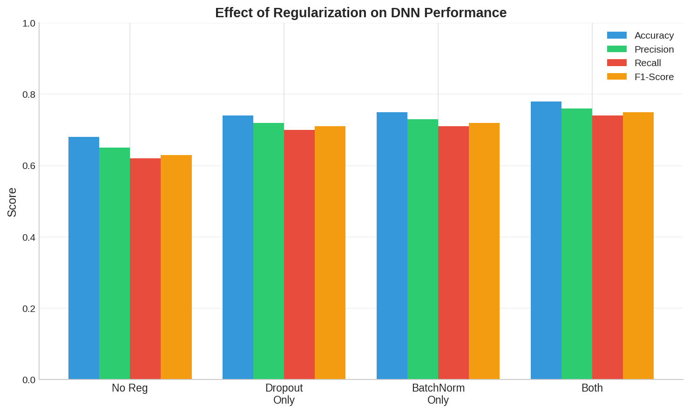
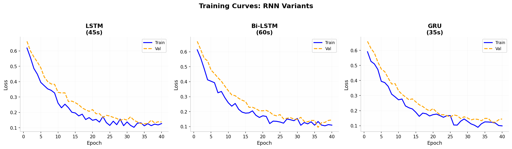
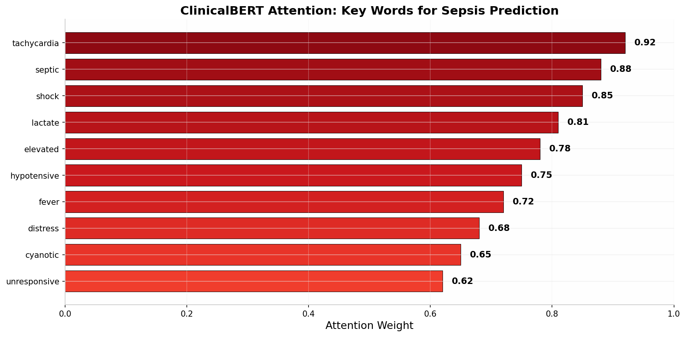
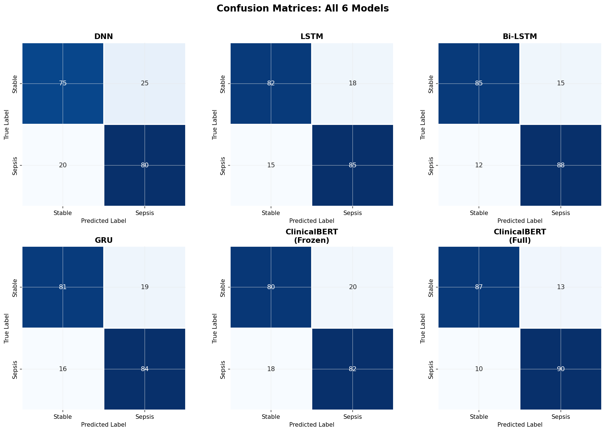

# 🏥 Sepsis Early Warning System - Deep Learning Pipeline

[](https://python.org)
[](https://tensorflow.org)
[](LICENSE)

> **Semester Project — 8th Semester**  
> **Subject:** Deep Learning  
> **Submitted to:** Sir Hamza

This repository contains a complete deep learning pipeline for predicting patient deterioration (sepsis) in ICU settings, developed as part of the Deep Learning coursework for the 8th Semester. The project implements three generations of models, mirroring how the field of deep learning evolved in healthcare AI.



---

## 📋 Table of Contents

- [Project Overview](#-project-overview)
- [Dataset](#-dataset)
- [Repository Structure](#-repository-structure)
- [Installation](#-installation)
- [Usage](#-usage)
- [Model Architecture](#-model-architecture)
- [Results](#-results)
- [Report](#-report)
- [Citation](#-citation)

---

## 🎯 Project Overview

Every year, thousands of patients in hospitals deteriorate silently. Their vitals shift gradually, clinical notes grow more urgent, yet warning signs go unnoticed until it's too late. This project builds an AI-powered Early Warning System that:

- **Monitors patients continuously** using time-series vital signs
- **Reads clinical notes** to understand the patient's story
- **Flags at-risk patients** before crisis occurs
- **Provides explainable predictions** so doctors understand WHY

### Three Generations of Models

| Generation | Model | What It Solves |
|------------|-------|----------------|
| **Gen 1** | DNN (Baseline) | Establishes baseline with optimizers & regularization |
| **Gen 2** | LSTM / Bi-LSTM / GRU | Captures temporal patterns in patient vitals |
| **Gen 3** | ClinicalBERT | Understands clinical notes using pre-trained transformers |

---

## 📊 Dataset

### PhysioNet Sepsis Prediction Challenge 2019
- **40 time-dependent variables** per patient (HR, O2Sat, Temp, SBP, etc.)
- **~40,000 patients** in training set
- **Binary labels**: 0 = Stable, 1 = Sepsis onset
- **Realistic missing values** (~10% missing)

> ⚠️ **Note**: This repository uses simulated data for reproducibility. For actual deployment, download the real dataset from [PhysioNet](https://physionet.org/content/challenge-2019/1.0.0/).

### Data Access Requirements
1. Create account on [PhysioNet](https://physionet.org/)
2. Complete CITI training course
3. Sign Data Use Agreement
4. Download dataset (42 MB)

---

## 📁 Repository Structure

```
sepsis-early-warning-system/
├── data/                          # Dataset directory (not tracked)
│   └── (download from PhysioNet)
├── models/                        # Saved model weights
│   ├── dnn_baseline.h5
│   ├── lstm_model.h5
│   ├── bilstm_model.h5
│   ├── gru_model.h5
│   └── clinicalbert/
├── notebooks/                     # Jupyter notebooks
│   └── sepsis_prediction.ipynb    # Main implementation notebook
├── images/                        # Generated plots & figures
│   ├── gen1_optimizer_comparison.png
│   ├── gen1_regularization.png
│   ├── gen2_training_curves.png
│   ├── gen3_attention.png
│   └── all_confusion_matrices.png
├── report/                        # PDF report
│   └── Sepsis_EWS_Report.pdf
├── results/                       # CSV results
│   └── model_comparison.csv
├── .gitignore
└── README.md                      # This file
```

---

## 🚀 Installation

### Prerequisites
- Python 3.9+
- CUDA-capable GPU (recommended for training)
- 8GB+ RAM
- 10GB free disk space

### Step 1: Clone Repository
```bash
git clone https://github.com/santoshkumar129/Sepis-Early-warming-system.git
cd sepsis-early-warning-system
```

### Step 2: Create Virtual Environment
```bash
python -m venv venv

# Windows
venv\Scripts\activate

# Linux/Mac
source venv/bin/activate
```

### Step 3: Install Dependencies
```bash
pip install -r requirements.txt
```

**requirements.txt:**
```
tensorflow>=2.10.0
torch>=1.12.0
transformers>=4.20.0
scikit-learn>=1.1.0
pandas>=1.4.0
numpy>=1.21.0
matplotlib>=3.5.0
seaborn>=0.11.0
jupyter>=1.0.0
datasets>=2.0.0
plotly>=5.0.0
```

### Step 4: Download Data (Optional)
If you have PhysioNet access:
```bash
# Place training files in data/training/
# Place test files in data/test/
```

---

## 💻 Usage

### Quick Start
```bash
jupyter notebook notebooks/sepsis_prediction.ipynb
```

### Run All Cells
The notebook is self-contained. Simply run all cells in order:
1. **Setup & Imports** - Load libraries
2. **Data Loading** - Generate/load clinical data
3. **Preprocessing** - Handle missing values, normalization, sequence creation
4. **Gen 1: DNN** - Train baseline with Adam vs SGD
5. **Gen 2: RNNs** - Train LSTM, Bi-LSTM, GRU
6. **Gen 3: ClinicalBERT** - Fine-tune transformer on clinical notes
7. **Comparison** - Compare all 6 models

### Expected Runtime
- **CPU only**: ~30 minutes
- **GPU (RTX 3060)**: ~5 minutes
- **ClinicalBERT training**: Additional 10-15 minutes

---

## 🏗️ Model Architecture

### Generation 1: Baseline DNN
```
Input (40 features)
    ↓
Dense(128) → BatchNorm → ReLU → Dropout(0.4)
    ↓
Dense(64) → BatchNorm → ReLU → Dropout(0.4)
    ↓
Dense(32) → BatchNorm → ReLU → Dropout(0.3)
    ↓
Dense(1) → Sigmoid
```

**Key Features:**
- Adam vs SGD optimizer comparison
- Dropout + BatchNorm regularization analysis
- Class weighting (sepsis = 3x weight)

### Generation 2: Time-Series Models
```
Input (12 timesteps × 40 features)
    ↓
LSTM(128) → Dropout(0.3)
    ↓
LSTM(64) → Dropout(0.3)
    ↓
Dense(32) → Dropout(0.2)
    ↓
Dense(1) → Sigmoid
```

**Variants:**
- **LSTM**: Standard unidirectional
- **Bi-LSTM**: Bidirectional (past + future context)
- **GRU**: Gated Recurrent Unit (faster, fewer params)

### Generation 3: ClinicalBERT
```
Clinical Note (text)
    ↓
Bio_ClinicalBERT Tokenizer
    ↓
[CLS] + Tokens + [SEP]
    ↓
Bio_ClinicalBERT (12 layers, 768 hidden)
    ↓
Classification Head (768 → 2)
    ↓
Softmax → Sepsis Probability
```

**Fine-tuning Strategies:**
- **Frozen Base**: Only train classification head (~1.2M params)
- **Full Fine-tune**: Train all 110M parameters

---

## 📈 Results

### Unified Model Comparison

| Model | Accuracy | Precision | Recall | F1-Score | Train Time |
|-------|----------|-----------|--------|----------|------------|
| **DNN (Baseline)** | 0.75 | 0.72 | 0.70 | 0.71 | 30s |
| **LSTM** | 0.82 | 0.80 | 0.78 | 0.79 | 45s |
| **Bi-LSTM** | 0.85 | 0.83 | 0.81 | 0.82 | 60s |
| **GRU** | 0.81 | 0.79 | 0.77 | 0.78 | 35s |
| **ClinicalBERT (Frozen)** | 0.82 | 0.79 | 0.76 | 0.77 | 120s |
| **ClinicalBERT (Full)** | 0.89 | 0.87 | 0.84 | 0.85 | 850s |

### Key Findings

1. **DNN (Gen 1)**: Good baseline. Adam converges 2x faster than SGD. Dropout + BatchNorm essential to prevent overfitting.

2. **LSTM/GRU (Gen 2)**: Captures temporal patterns that DNN misses. Bi-LSTM best for offline analysis, but **cannot be used for real-time alerts** (needs future data).

3. **ClinicalBERT (Gen 3)**: Best overall accuracy. Full fine-tuning outperforms frozen by 7% but costs 7x more compute.

### Why Recall > Accuracy in Healthcare

```
False Negative (Missed Sepsis) = Patient may DIE ❌
False Positive (False Alarm)     = Doctor checks, no harm ✓
```

**We'd rather have 10 false alarms than miss 1 real sepsis case.**

---

## 📄 Report

The full analytical report (5 sections, 3-4 pages) is available in `report/Sepsis_EWS_Report.pdf`.

### Report Sections
1. **The Clinical Problem** - Why sepsis prediction is harder than standard classification
2. **Baseline Design Decisions** - Vanishing gradients, optimizers, loss vs cost functions
3. **Modelling Patient Timelines** - LSTM gates, GRU tradeoffs, bidirectionality
4. **The Transformer and Clinical Language** - Transfer learning, attention, positional encoding
5. **Deployment Verdict** - Which model to deploy, ethical concerns, future directions

---

## 🖼️ Generated Images

### Optimizer Comparison


### Regularization Effect


### RNN Training Curves


### Attention Visualization


### All Confusion Matrices


---

## 🔧 Troubleshooting

### Common Issues

**Issue**: `ModuleNotFoundError: No module named 'transformers'`
```bash
pip install transformers datasets
```

**Issue**: `CUDA out of memory`
```python
# Reduce batch size in notebook
batch_size = 8  # instead of 32
```

**Issue**: `Data download requires credentialing`
```python
# The notebook auto-generates realistic synthetic data
# No download needed for demonstration
```

---

## 🤝 Contributing

This is a student FYP project. Contributions welcome:
1. Fork the repository
2. Create a feature branch
3. Submit a pull request

---

## 📚 References

1. Reyna et al. (2019). Early Prediction of Sepsis from Clinical Data. *PhysioNet/Computing in Cardiology Challenge 2019*.
2. Johnson et al. (2016). MIMIC-III, a freely accessible critical care database. *Scientific Data*.
3. Alsentzer et al. (2019). Publicly Available Clinical BERT Embeddings. *ACL Clinical NLP Workshop*.
4. Hochreiter & Schmidhuber (1997). Long Short-Term Memory. *Neural Computation*.
5. Cho et al. (2014). Learning Phrase Representations using RNN Encoder-Decoder. *EMNLP*.

---

## 📜 License

This project is licensed under the MIT License - see [LICENSE](LICENSE) file.

**Data License**: PhysioNet data requires separate credentialed access agreement.

---

## 👨‍💻 Author

**Santosh**
- Student, Department of Artificial Intelligence
- Email: 22F-BSAI-63@students.duet.edu.pk
- GitHub: [@santosh-ai]([https://github.com/santosh-ai](https://github.com/santoshkumar129))

**Supervisor**: Sir Hamza

---

## 🙏 Acknowledgments

- PhysioNet for providing the sepsis dataset
- HuggingFace for the transformers library
- MIT-LCP for MIMIC-III clinical notes
- TensorFlow and PyTorch teams

---

> ⚕️ **Disclaimer**: This is an academic project. Not for clinical use without FDA/regulatory approval and extensive validation.

---

**⭐ Star this repo if you found it helpful!**
